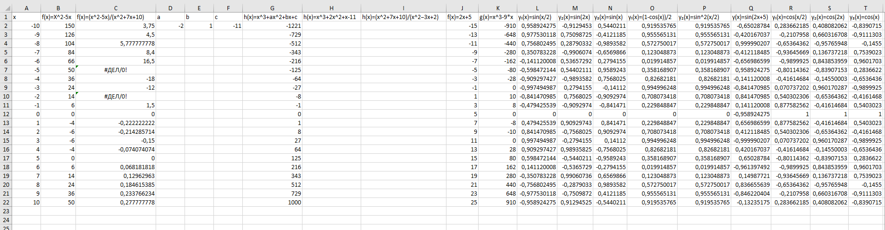
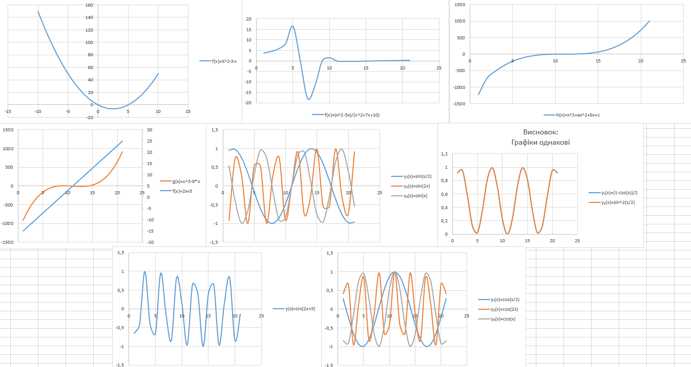
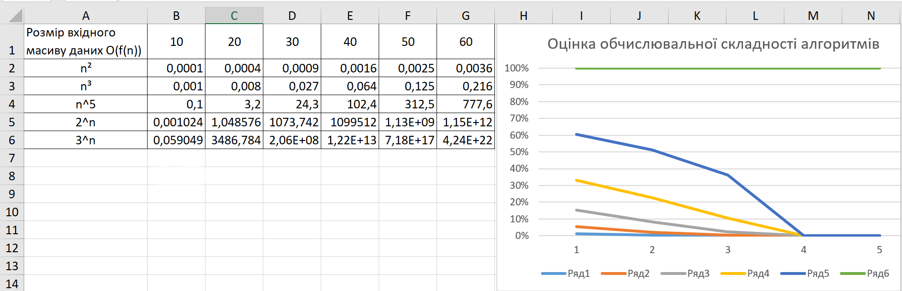
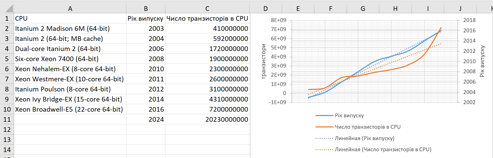

# Навігація по документу
- [Титулка](#титулка)
- [1.1 Вправа 1: Побудова графiкiв функцiй в Microsoft Excel](#11-вправа-1-побудова-графiкiв-функцiй-в-microsoft-excel)
- [1.2 Вправа 2: Оцiнка обчислювальної складностi алгоритмiв](#12-вправа-2-оцiнка-обчислювальної-складностi-алгоритмiв)
- [1.3 Вправа 4: Побудова лiнiйного тренду для аналiзу даних](#13-вправа-4-побудова-лiнiйного-тренду-для-аналiзу-даних)
- [1.4 Контрольнi питання](#14-контрольнi-питання)
- [Висновок](#висновок)
## Титулка

<strong>МІНІСТЕРСТВО ОСВІТИ І НАУКИ УКРАЇНИ
 НАЦІОНАЛЬНИЙ ТЕХНІЧНИЙ УНІВЕРСИТЕТ УКРАЇНИ
 «КИЇВСЬКИЙ ПОЛІТЕХНІЧНИЙ ІНСТИТУТ
  ІМЕНІ ІГОРЯ СІКОРСЬКОГО»
   Навчально-науковий інститут телекомунікаційних систем
  Кафедра телекомунікацій</strong>
     Дисципліна: «Інформатика. Частина 1.»
 <strong>ПРОТОКОЛ ВИКОНАННЯ ЛАБОРАТОРНОЇ РОБОТИ № 2</strong> 
 «Лабораторна робота 2. Використання Microsoft Excel для побудови графiкiв функцiй i аналiзу даних.»

   
Виконали студенти групи 
 ЦС-31 Бригада № 8:
 - Шваліковський Вадим
 - Шилан Владислав
 - Шумлянський Артем
 - Якимець Ігор
  Перевірила: 
 асистент кафедри ТК 
 Олена ФУРТАТ

   
<strong>КИЇВ 2023</strong>

## 1.1 Вправа 1: Побудова графiкiв функцiй в Microsoft Excel

 

## 1.2 Вправа 2: Оцiнка обчислювальної складностi алгоритмiв
**Для заданих в таблицi розмiрiв масивiв вхiдних даних, обчислити час в секундах, який буде витрачено для оброблення таких даних на комп’ютерi з продуктивнiстю 10 6 операцiй за секунду.**

## 1.3 Вправа 4: Побудова лiнiйного тренду для аналiзу даних
**Чи виконується закон Гордона Мура?**
Для заданих в таблицi даних щодо степенi iнтеграцiї (числа) транзисторiв на одному кристалi мiкросхем процесорiв (CPU), якi виготовлялися у попереднi роки фiрмою Intel побудувати лiнiйний тренд i обчислити яке число транзисторiв ми можемо очiкувати за цими даними у 2024 роцi.

## 1.4 Контрольнi питання
**1. Як знайти критичнi точки функцiї?**

Для того щоб знайти критичні точки функції треба знайти точки, в яких похідна функції дорівнює нулю або не існує.

**2. Як знайти iнтервали зростання/спадання функцiї?**

Для знаходження інтервалів зростання й спадання функції потрібно вивчити знак її похідної. 

Алгоритм:
- Знайдіть похідну функції.
- Знайдіть критичні точки: Знайдіть значення x, при яких похідна дорівнює нулю або не існує. 
- Розбийте графік на інтервали: Розділіть діапазон значень x на інтервали за допомогою критичних точок. 
- Визначте знак похідної на кожному інтервалі: Візьміть початкову точку на кожному інтервалі і підставте її в похідну функції. Визначте знак похідної в цій точці.
 
 Якщо похідна додатня на інтервалі, то функція зростає на цьому інтервалі.
 
 Якщо похідна від'ємна на інтервалі, то функція спадає на цьому інтервалі.
 
 Якщо похідна дорівнює нулю, то це може бути точка перегину.

**3. Що таке ектремуми функцiї?**

Екстремуми функції - це точки на графіку функції, в яких функція досягає найбільшого значення або найменшого значення на певному інтервалі.

**4. Абсолютна, вiдносна i змiшана адресацiя комiрок в Excel. Продемонструвати на
прикладах.**

Абсолютна, вiдносна i змiшана адресацiя комiрок в Excel. Продемонструвати на
прикладах. У Microsoft Excel є три типи адресації комірок: абсолютна, відносна і змішана адресація. Кожен з цих типів дозволяє вам по-різному посилатися на комірки в аркуші. Розглянемо кожен тип адресації на прикладах:
-Абсолютна адресація: В абсолютній адресації посилання на комірку закріплюються і не змінюються при копіюванні формули в інші комірки. Приклад: Допустимо, у комірці A1 є число 10, і у комірці B1 ви вводите формулу =A1C1. Якщо ви скопіюєте цю формулу до комірок B2 і B3, то в обох випадках вона буде посилатися на комірку C1 (абсолютна адресація), і результат буде такий самий, як у B1.
-Відносна адресація: В відносній адресації посилання на комірку змінюються відносно положення формули при копіюванні. Приклад: Якщо у комірці A1 є число 10, і у комірці B1 ви вводите формулу =A1*C1, а потім копіюєте її до комірок B2 і B3, то в результаті формули в B2 буде =A2*C2, а в B3 - =A3*C3. Посилання на комірки змінилися відповідно до положення формули.
-Змішана адресаці. В змішаній адресації одна частина посилання закріплена (або абсолютна), а інша частина є відносною. Зазвичай використовується з символами  для закріплення частини адреси. Приклад: Якщо у комірці A1 є число 10, і у комірці B1 ви вводите формулу A1B1, то при копіюванні формули до комірок B2 і B3 лише одна з адрес буде змінена. У B2 формула буде A2B1, а у B3 A3B1. Адреса A1 залишиться незмінною, а адреса B1 також буде незмінною.
Ці типи адресації використовуються для зручності обчислення.

**5. Форматування дiаграми(графiк): ряди даних.**

**6. Форматування дiаграми(графiк): координатнi осi.**

**7. Форматування дiаграми(графiк): назва дiаграми i легенда.**

Пункти 5-7 є елементами графіків/діаграм.

**8. Побудова лiнiйного тренду в Excel.**
 
 Це функція, що доступна в меню елементів графіка/діаграми. Вона вказує тенденцію зміни даних, її використовують для складання прогнозів. Лінію тренда будують на основі діаграми.
 ## Висновок
 Під час виконання цієї лабораторної роботи ми навчилися користуватися Excel, працювати з графіками/діаграмами та їхніми даними в таблицях.